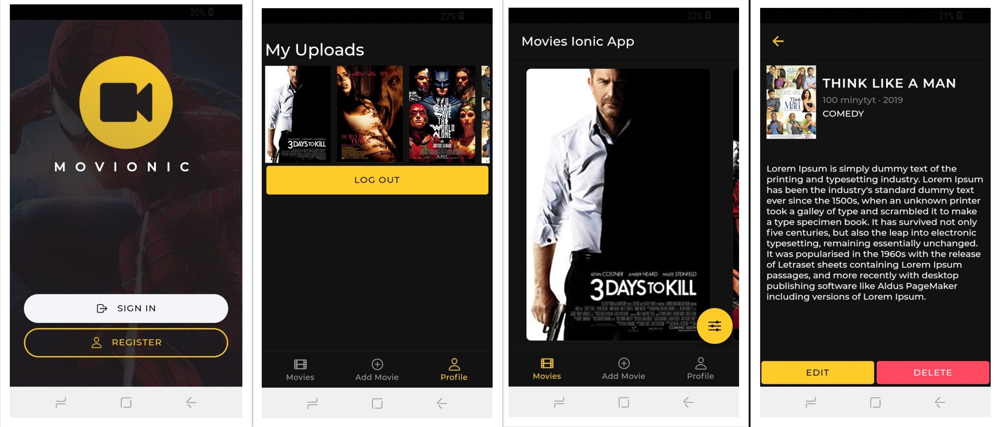

# Movionic App (Available On Google Play)
Movies App Built using Ionic 5 and Angular 9. This project is a Movie app that allows the user to create an account then they are able to swipe through a movies slide. The user is able to add their own movies. The app will try and find a poster for the movie based on the provided title. The rest of the information is totally based on the user. The user is able to access all movies that they create from their profile page. I also did some UI work to make the app look nice.

Google Play Link: https://play.google.com/store/apps/details?id=io.init.movies  
API Link: https://initmovies.herokuapp.com/api/movies  

